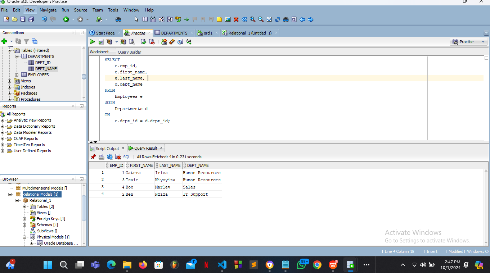
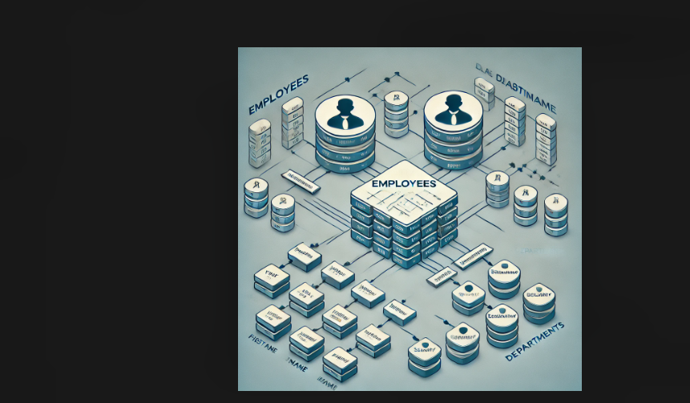

# pl_sql_tests

Employee and Department Management System

Problem Statement
The system is designed to manage and organize employee records and their respective departments within an organization. The goal is to ensure that employee details such as their ID, name, hire date, and department assignment are easily stored, retrieved, and modified when necessary. The system also manages departmental information and ensures that the relationship between employees and departments is properly maintained and accessible.

## SQL Commands Executed

The following SQL commands were executed to set up and manage the database:

1. **CREATE TABLE**: 
   - Used to define the structure of the `Employees` and `Departments` tables.
   - `Employees` includes columns like `emp_id`, `first_name`, `last_name`, `hire_date`, and `dept_id` (Foreign Key).
   - `Departments` includes columns like `dept_id` and `dept_name`.

   ```sql
   CREATE TABLE Employees (
     emp_id NUMBER PRIMARY KEY,
     first_name VARCHAR2(50),
     last_name VARCHAR2(50),
     hire_date DATE,
     dept_id NUMBER REFERENCES Departments(dept_id)
   );

   CREATE TABLE Departments (
     dept_id NUMBER PRIMARY KEY,
     dept_name VARCHAR2(50)
   );
   ```

2. **INSERT INTO**: 
   - Used to add data into the `Employees` and `Departments` tables.

 **sql commands**
 
   INSERT INTO Departments (dept_id, dept_name) VALUES (1, 'HR'), (2, 'Finance');
   INSERT INTO Employees (emp_id, first_name, last_name, hire_date, dept_id) VALUES (101, 'John', 'Doe', SYSDATE, 1);
   ```

3. **SELECT**: 
   - Retrieve data from the tables.
   - Example of a basic `JOIN` query to view employees and their associated departments.

 **sql commands**
   
   SELECT e.emp_id, e.first_name, e.last_name, d.dept_name 
   FROM Employees e
   JOIN Departments d ON e.dept_id = d.dept_id;
   

5. **UPDATE**: 
   - Modify existing records in the database.
   
   **sql commands**
   
   UPDATE Employees SET dept_id = 2 WHERE emp_id = 101;
 

7. **DELETE**: 
   - Remove records from the database.
 **sql commands**

   DELETE FROM Employees WHERE emp_id = 101;


8. **DDL (Data Definition Language)**: 
   - Commands like `CREATE` and `ALTER` to define or modify the database structure.

9. **DML (Data Manipulation Language)**: 
   - Commands like `INSERT`, `UPDATE`, and `DELETE` to manage data.

10. **TCL (Transaction Control Language)**: 
   - Commands like `COMMIT` and `ROLLBACK` to control database transactions.

SCREENSHOTS

SQL Queries and Results:

1. Creating the Tables:


2. Inserting Data:
 ![Insert Data]"C:\Users\user\Desktop\AUCA\PL SQL\Activity 2 Screenshots\row insertion query.png")

3. Join Query Output:
 

4.Update and Delete Operations:

   [Update and Delete Queries](Update and Delete Operation.png)

Conceptual Diagram

The conceptual diagram below illustrates the relationship between the `Employees` and `Departments` tables in this system:



Explanations of the Results and Transactions

1. Table Creation: The `Employees` and `Departments` tables were successfully created, defining relationships between employees and their departments. The `dept_id` in the `Employees` table is a foreign key referencing the `Departments` table, enforcing referential integrity.

2. Data Insertion: Several records were inserted into the tables. For instance, employee John Doe was assigned to the HR department, and later moved to the Finance department using an `UPDATE` statement.

3. Joins: The `JOIN` query combines the `Employees` and `Departments` tables to display employee details along with their respective department names, providing meaningful insights into the organizational structure.

4. Update and Delete Operations: Changes were made to the database through the `UPDATE` and `DELETE` statements, demonstrating how data can be modified or removed efficiently.
